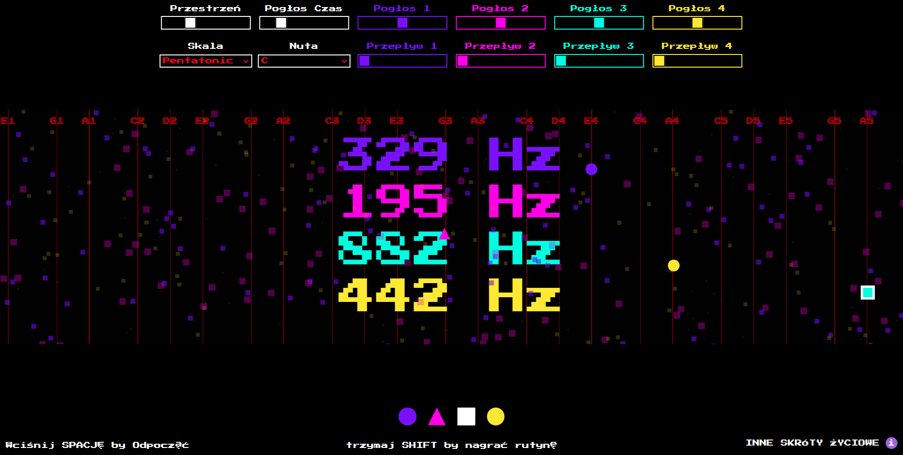

# End of the World – Sound & Visual Installation

This experimental application rethinks how sound objects' "movement" is recorded and overdubbed. It was built primarily for live performance rather than production. It's in polish because it was originally created for the "Zupa Fotonów" exhibition, where it received a warm reception <3 In the future, song exporting features might be implemented :) 

---

## Project Overview // translated

**Theme:**  
*Playroom and the End of the World.*  
We all have our desires, visions, needs, passions, playfulness, and aesthetic senses. We nurture a world of sensations while the real world quietly fades into the background. We will awaken only to the sound of the End of the World sirens.

**Concept:**  
> “End of the World” is a sound-visual installation. It is easiest to play it so that the sirens proclaim the End of the World. However, you can also guide each Aspect, adjust them one by one to bring about harmony. Just like in life.

---

## Game Rules

**GAME RULES**  
It's easy to fall into chaos. The scales (lines) represent values that help you achieve harmony – set the sound on them to hear the balance.

You can change these guidelines – but correcting the Aspects is YOUR task.

If you succeed at something, teach someone else ❤

**LIFE SHORTCUTS**  
- **SPACE** — Toggle Play/Pause  
- **Q** — Change the active life aspect (you can also click the shape at the bottom of the screen)  
- **SHIFT** — Introduce a routine or record a new one. Rhythms and habits help you navigate life.  
- **D** — Adjust a part of a routine mid-performance. A habit is easier to change gradually by replacing it with a new one.  
- **P** — Enjoy the rhythm of the recorded routine (works both while playing and pausing).  
- **CTRL+R** — Sometimes it's good to start over.

*Additional hidden experimental functions are implemented – feel free to explore the code.*

---

## Prerequisites

- **p5.js:** Responsible for the visual and interactive elements.
- **p5.sound:** Provides sound synthesis and processing functionality.
- A modern web browser with ES6 JavaScript support.

---

## Installation and Usage

1. **Clone or Download the Repository:**  
   ```bash
   git clone https://github.com/soundprayer/creative_gadam_three_sounds_high_new_base_4_shift.git
   cd creative_gadam_three_sounds_high_new_base_4_shift
   ```

2. **Ensure Dependencies:**  
   Make sure the p5.js and p5.sound libraries are available. They can be installed via npm or via the provided local files in the node_modules folder.

3. **Running the Project:**  
   Open the using a live server (e.g., Live Server extension in Visual Studio Code). Web demo will be implemented soon, stay in touch!

---

## Technical Details

**Language:** JavaScript

**File Structure:**
- `index.html`: Contains the HTML structure and embedded CSS.
- `sketch.js`: Main JavaScript file that implements p5.js functionality and sound processing.

---

## Credits & License

**Developed by Soundprayer.** Feel free to use this code in your projects – I’d be happy to be mentioned if you do.

**License:** MIT License?

---

## Contact

For questions, collaborations, or suggestions, please reach out via your preferred channel: m.rusnar@gmail.com, instagram: https://www.instagram.com/gadam_do_siebie/
www.gadamstudio.pl
